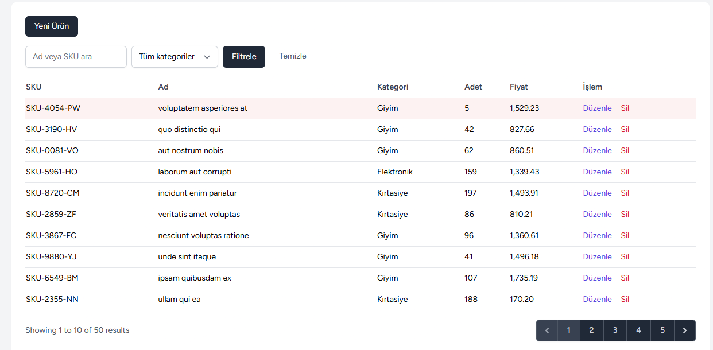
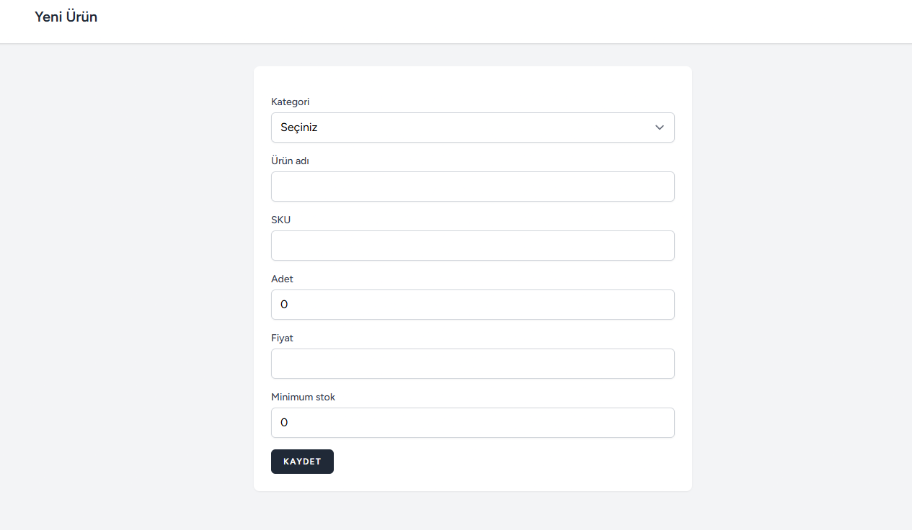

# Laravel Stok Takip
[](https://github.com/isadost/laravel-stok-takip/actions/workflows/tests.yml)
<<<<<<< HEAD

=======
>>>>>>> 9b32a72 (Fix CI badge link and update README)
Laravel ile geliştirilmiş, kullanıcı girişi olan bir stok takip uygulaması. Ürün yönetimi, arama, kategori filtresi ve düşük stok uyarısı içerir. Otomatik testlerle doğrulanmıştır.





## Özellikler

- Kayıt, giriş ve çıkış (Laravel Breeze)
- Ürün ekleme, listeleme, düzenleme ve silme
- SKU benzersizliği ve negatif stok engeli (hem doğrulamada hem veritabanında)
- Ad veya SKU ile arama, kategoriye göre filtreleme
- Adedi minimum stoğa eşit veya altında olan ürünlerin vurgulanması
- Sayfalama (arama ve filtre sayfalar arasında korunur)

## Teknolojiler

PHP 8.4, Laravel 13, SQLite, Blade, Tailwind CSS, Vite, PHPUnit

## Kurulum

```bash
git clone https://github.com/isadost/laravel-stok-takip.git
cd laravel-stok-takip
composer install
npm install
copy .env.example .env
php artisan key:generate
php artisan migrate --seed
npm run build
php artisan serve
```

Örnek kullanıcı: `test@example.com` / `password`

## Testler

```bash
php artisan test
```

<<<<<<< HEAD
Kimlik doğrulama akışları ve ürün işlemlerini kapsayan otomatik testler, kimlik doğrulama akışları (Breeze) ve ürün işlemleri. Ürün testleri şunları kapsar: girişsiz erişimin engellenmesi, ürün oluşturma, yinelenen SKU'nun reddi, negatif adedin reddi, güncellemede kendi SKU'sunu koruma, başka ürünün SKU'suyla çakışmanın engellenmesi, silme, arama, kategori filtresi ve düşük stok vurgusu.
=======
Kimlik doğrulama akışlarını (Breeze) ve ürün işlemlerini kapsayan otomatik testler bulunur. Ürün testleri şunları kapsar: kimlik doğrulama akışları (Breeze) ve ürün işlemleri. Ürün testleri şunları kapsar: girişsiz erişimin engellenmesi, ürün oluşturma, yinelenen SKU'nun reddi, negatif adedin reddi, güncellemede kendi SKU'sunu koruma, başka ürünün SKU'suyla çakışmanın engellenmesi, silme, arama, kategori filtresi ve düşük stok vurgusu.
>>>>>>> 9b32a72 (Fix CI badge link and update README)

## Tasarım Kararları

- **Silme kısıtı:** Ürünü olan bir kategori silinemez (`restrictOnDelete`). Böylece kategori silinince ürünler sessizce kaybolmaz.
- **Fiyat tipi:** Para değerleri `float` yerine `decimal(10,2)` olarak saklanır, yuvarlama hatası olmaz.
- **N+1 önlemi:** Liste sayfasında kategoriler `with('category')` ile tek sorguda yüklenir.
- **Sayfalama:** Filtreler `withQueryString()` ile sayfalar arasında korunur.

## Yapılacaklar

- [ ] Kategori yönetim ekranı
- [x] GitHub Actions ile testlerin otomatik çalışması
- [ ] Selenium ile arayüz testleri
